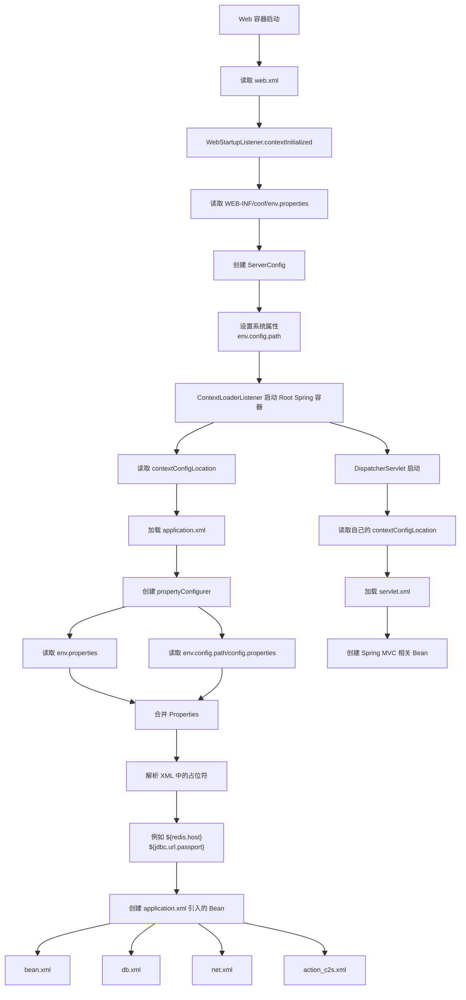

# LoginSrv 启动流程

## 1. Spring 配置结构

### `web.xml`

```text
全局 contextConfigLocation
└── application.xml
    ├── propertyConfigurer
    ├── bean.xml
    ├── db.xml
    ├── net.xml
    └── action_c2s.xml

DispatcherServlet 的 contextConfigLocation
└── servlet.xml
```

## 2. 配置加载过程

1. Web 容器启动，读取 `web.xml`。
2. `WebStartupListener.contextInitialized` 读取 `/WEB-INF/conf/env.properties`。
3. 创建 `ServerConfig`，并设置系统属性 `env.config.path`。
4. `ContextLoaderListener` 启动 Root Spring 容器。
5. Root 容器读取 `contextConfigLocation`，加载 `application.xml`。
6. 创建 `propertyConfigurer`，根据 `locations` 读取并合并：
   - `/WEB-INF/conf/env.properties`
   - `${env.config.path}/config.properties`
7. Spring 替换 XML 中的 `${xxx}` 占位符。
8. 创建 `application.xml` 引入的业务 Bean。
9. `DispatcherServlet` 启动，读取自己的 `contextConfigLocation`，加载 `servlet.xml`。
10. 创建 Spring MVC 相关 Bean。

## 3. 启动流程图



## 4. 相关文件

| 用途 | 文件 |
| --- | --- |
| Web 配置入口 | `loginsrv/WebContent/WEB-INF/web.xml` |
| Web 启动初始化 | `loginsrv/src/com/gow/loginserver/web/WebStartupListener.java` |
| Spring 配置入口 | `loginsrv/src/application.xml` |
| 配置占位符处理器 | `common/src/com/gow/common/util/CustomizedPropertyConfigurer.java` |
| 业务 Bean 配置 | `loginsrv/src/bean.xml` |
| 数据库配置 | `loginsrv/src/db.xml` |
| 网络配置 | `loginsrv/src/net.xml` |


