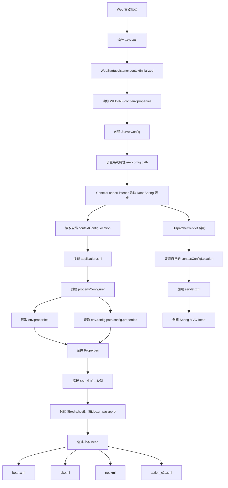

# Web 启动读取配置流程



## 配置关系

```text
web.xml
├── 全局 contextConfigLocation
│   └── application.xml
│       ├── propertyConfigurer
│       ├── bean.xml
│       ├── db.xml
│       ├── net.xml
│       └── action_c2s.xml
│
└── DispatcherServlet 的 contextConfigLocation
    └── servlet.xml
```

## 关键代码位置

```text
web.xml：loginsrv/WebContent/WEB-INF/web.xml
启动初始化：loginsrv/src/com/gow/loginserver/web/WebStartupListener.java
Spring 入口：loginsrv/src/application.xml
配置处理器：common/src/com/gow/common/util/CustomizedPropertyConfigurer.java
配置使用：loginsrv/src/bean.xml、db.xml、net.xml
```

## 一句话总结

Web 容器先读取环境配置并确定配置目录，再由 Spring 的 propertyConfigurer 读取 properties 文件，把配置值替换到各个 XML Bean 配置中。
